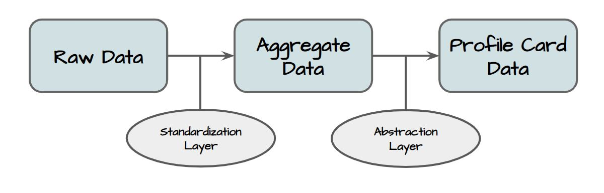

# Data Modeling    

This section is a snippet, looking to be expanded. 

## Stages of Data
Under the hood, Data on the Prifina platform is accessible in a number of formats.
While data is stored in the raw formats by which a user provides it, we provide API layers
which simplify data access for developers and improve control for the users.

### Raw Data
All data, as it was imported or provided by the user, in the structure it was provided in. This is the only state in which data is statically stored, and it is kept in JSON format. Raw data is parsed by the standardization layer to provide aggregate data.

### Aggregate Data
Raw data standardized for ease of use. It is available exclusively to Local Data and Widget Apps, and can be accessed via GraphQL queries.

### Profile Card Data
Subsets of aggregate data which can be anonymized or abstracted. Available to all applications and services which receive permission from the user. These are outlined by their corresponding Profile Cards, and allow the user to control the availability of their data and easily provide access to third-parties.

## Core Platform Data Model  
  
The Prifina platform has it's own data model for its own internal needs. This is a core workstream for product 
development and the product architecture overall, and is mainly exposed publicly in developer tools and documentations 
for how applications are built and ultimately connected to the Prifina platform. 

## Personal Cloud Data Model  

The individuals personal data cloud is where the user brings their data. This data model for the data that exists in the 
users own personal data cloud, becomes the data layer that ultimately the applications that run in the Prifina environment
are built on top of. 

### Use of GraphQL Schema  

The main work for data modeling is building the data model as a GraphQL Schema. This will allow the applications the data
layer needed to interact with the personal data cloud, as well as allow a GraphQL API to be connected later in development. 

## Working principles for work on data modeling. 

### Source and Raw data 

1. Source data attributes, objects and information kept with 100% integrity unchanged, structure cleaned up to remove unnecessary formatting 
2. Raw data is observed and documented 100% from the source, no interpretation or opinion is inferred
3. Source and raw data is main focus

### Aggregated data 

Aggregated data models are very carefully planned, with at least the following principles:

1. Objectively clear data that can be aggregated, is aggregated, i.e. photos
2. Relatively easy to interpret
3. Difficult to interpret  

Points 2 and 3 consist “danger zones” and need to be dealt with very carefully.

**[Improve This Doc?](https://github.com/prifina-admin/internal-docs/) / [Guidelines](http://internal.prifina.com/contribute/)**

